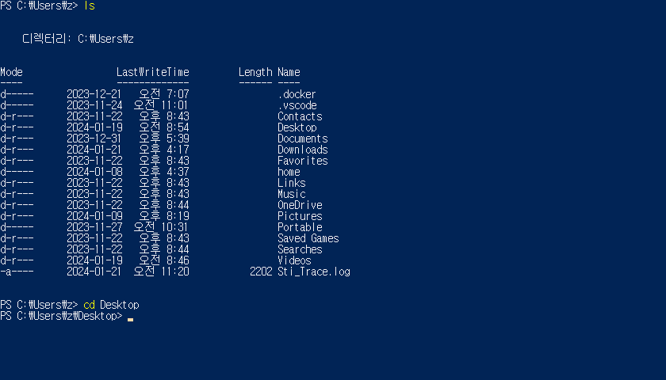
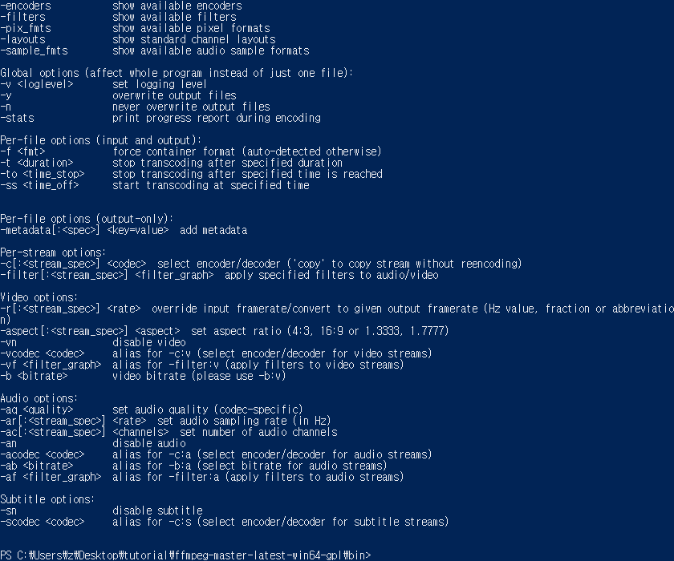
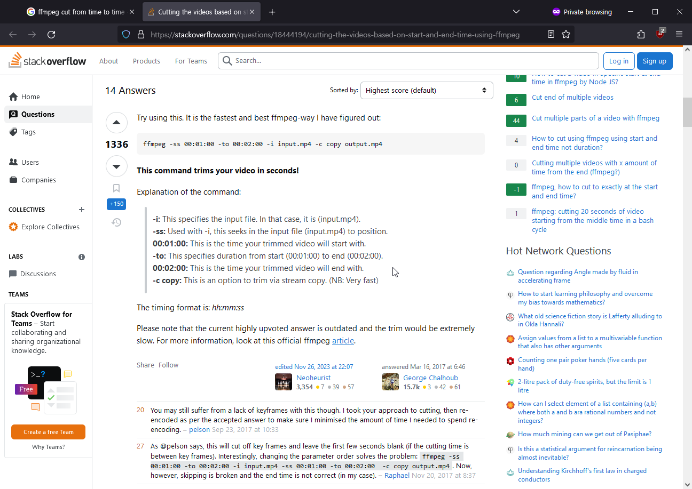
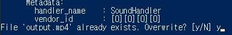
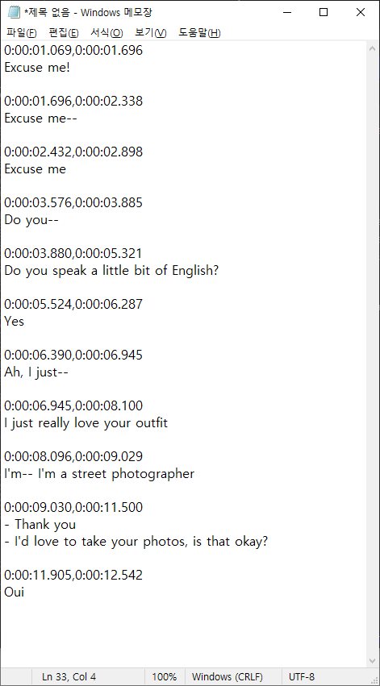
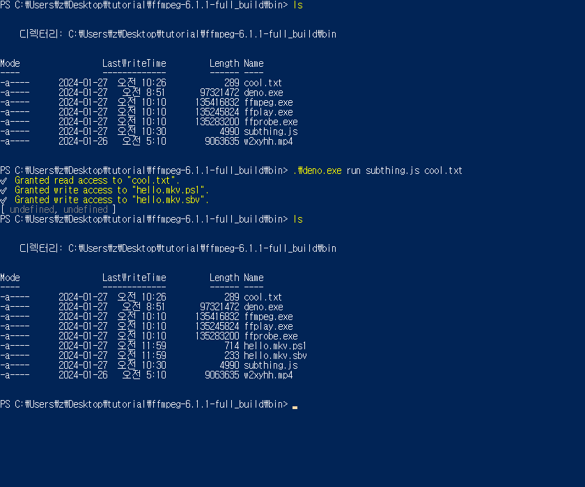

# using command-line tools on windows!

hello, today I will walk through the processes of how to run some command-line programs on windows.

## what is a command-line program?
command-line programs are like other computer programs, e.g. your web browser, or discord, etc. except you run them by typing some commands in a "command line"/"command prompt"/"terminal"!.

why command-line instead of regular programs you can just click around to use and have graphics? I believe since command-line "commands" are just some text, it is much easier for programmers to write command-line programs than graphical clicky programs. So, it ends up that are often many very useful programs that are only command-line programs.

## opening a terminal/command line
first, let us open a terminal. how? on windows, there are a few pre-installed terminal command-prompt things. In my opinion they are actually kind of meh and use a different tool called "windows subsystem for linux", however I will avoid installing extra stuff more than is necessary in this tutorial. So I have selected the windows command-prompt called "Powershell". (btw "shell" means "terminal" means "command prompt/line" approx.)

### opening powershell
if you search for the "powershell" program in your windows menu, you can click it and it will open up. it will look something like this:


It will have something that approx looks like that. Most important is the bit that says `C:\Users\<your username>` (my user name is just "z"). That `C:\Users\<your username>` signifies your *working directory*, i.e. what folder you currently reside in on your computer!!

### navigating around different folders
When using the command-line, you will be navigating around your computer a lot! so, let us learn how to move around.

#### listing the "working directory" (note: "directory" means "folder")

You can **l**i**s**t the current files/folders in your "working directory" by typing `ls` into the command prompt, then pressing Enter.

hopefully, somthing like this will show up:


what shows up will be a list of all the files/folders in your `C:\Users\<your username>` folder!

#### changing your "working directory"

In this tutorial, I will store all my files on my Desktop in a folder called "tutorial". however, I don't have that folder yet! So let's create it.

You can **c**hange your working **d**irectory by typing `cd <the folder you want to change to>`. In this case i want to go to my Desktop (as it is listed when i used `ls` above). So I can type `cd Desktop`.



note that that bit on the line where i type the commands has changed to `C:\Users\z\Desktop>`!! because i have changed directory to my Desktop!.

> note: if you type `ls` right now, it will list all the files/folders on your Desktop!

now, I will create a folder to store the tutorial files. I could do this regularly, by just going to my desktop and right-clicking or something and making a new folder. However, I can also do this by just typing `mkdir <name of folder i want>` while inside my Desktop folder (i already am)!

So, I will type `mkdir tutorial` and then `cd tutorial` in order to **m**a**k**e my "tutorial" **dir**ectory and then **c**hange my working **d**irectory to that new directory.


> tip: you can press Ctrl+L to clear your terminal screen

> important tip: you can use `..` to change directory "backwards"
>
> for example, if you are currently inside `C:\Users\username\Desktop\tutorial`, and you want to go to `C:\Users\username\Desktop`, you can type `cd ..` to do that!
>
> another example: if you are in `C:\Users\username\Desktop\tutorial` and want to go to `C:\Users\username`, you can type `cd ..\..`
>
> final example: if you are in `C:\Users\username\Desktop\tutorial` and want to go to `C:\Users\username\Pictures`, you can use `cd ..\..\Pictures`!!

### running a program

ok, now we are in a nice new folder to do whatever we want in it!

let us now run the command-line programs we want!!

#### downloading the program

We will use the program "ffmpeg". it is a very useful program for converting and processing video and audio! We can download it by just googling "ffmpeg" and going to the download section. We are running Windows, so we want to download a "Windows Build".


I do not think it matters which one you download. But I recommend clicking the "Windows builds by BtbN" (<https://github.com/BtbN/FFmpeg-Builds/releases>), because the other one I believe you would need to also install 7zip to unzip the files. I will use this "BtbN releases" for the rest of tutorial!

> note: hi, its me from the future! it turns out that these BtbN releases had some problems for me, and i switched over to the other ones haha!!oops..
>
> you can download the other ones from here <https://github.com/GyanD/codexffmpeg/releases/tag/6.1.1> the `ffmpeg-6.1.1-full_build.zip`, and the tutorial should be basically exactly the same except the folder is named differently (`ffmpeg-6.1.1-full_build` instead of `ffmpeg-master-latest-win64-gpl`). very sorry about this !
>
> or you can just follow the tutorial as-is and when it gets to the point where i realise it has some problems ill let you know and you can just.. download it then because the tutorial will switch over to it


I downloaded the "ffmpeg-master-latest-win64-gpl.zip" file from that website (github), and then unzipped the contents to my "working directory" (`C:\Users\z\Desktop\tutorial`).

#### running the program!!

OK, now in your "working directory", you should have a folder containing ffmpeg stuff!! you can explore these folders by using `cd` and `ls` as you please.


> tip: you can press "tab" while typing a command for the command-prompt to try to autocomplete what you are typing. this is especially helpful while typing long file names!

> note: the second command i typed in the above screenshot (`cd .\ffmpeg-master-latest-win64-gpl\`) is equivalent to just `cd ffmpeg-master-latest-win64-gpl`. a period (`.`) represents the current directory. i used the tab autocomplete when typing that command, and it added the `.\` in front and `\` afterwards, idrk why.

Here, the actual ffmpeg "program" is located in `ffmpeg-master-latest-win64-gpl\bin\` and is named `ffmpeg.exe`!! it should be similarish for you!

To run it, you can simply type the name of the file. However, in the case that you are in the same directory as the program, you must include `.\` at the beginning of the name!! because otherwise the command prompt will not know to try to execute it (dont ask me why bc idrk). `.` just means the current directory, so `.\ffmpeg.exe` means "ffmpeg.exe, which is in the current directory".


omg!! we've run the program! that big text it just gave us is just informing us about what it is capable of doing and stuff. it gave us that big text and exited.

### what can we do with the program??

it is very exciting now that we have run the program. but what can the program do? this is a good question. usually, you would actually probably just google something like "ffmpeg how do i do ABC" and then people will tell you how to run the program to accomplish what you want.

However, also most programs will have some kind of "help" functionality built-in to them. and to access it, you would often type something like `PROGRAM --help` or `PROGRAM -h`. Notice the dashes in front of the `help` and `h`!! dashes are very common in specifying command-line program "arguments" (arguments = things that you type after `PROGRAM`)

so, we can access ffmpeg help by typing `.\ffmpeg.exe --help`



and in this case the 'help' is quite long and kind of not very helpful imo idk. oh well!

## doing a thing with the program

so far, we have successfully "run" ffmpeg twice: once without any "arguments" and once with a `--help` "argument". To make ffmpeg do nice things, we simply would need to pass it yet different "arguments".

so, let's do a nice thing! I will decide what we are doing because I am writing this tutorial

## slicing a video

a common nice thing someone might want to do is to cut out a small slice of a larger video. take a little clip!. so, let us do that.

I will use this video!!: [link to video (its named weirdly because i was going to host it somewhere else but eventually decided not to)](media/w2xyhh.mp4)


i have just downloaded it into the same folder as my ffmpeg.exe program


(when i run `ls` you can see that it is in the same folder, named as `w2xyhh.mp4`)

Let us cut out the bit of the video where hyein says "oui", i would say.. approx second 11 of video to second 13 of video.

how do we do this?? well actually remember how i said that you basically just google it most of time?? to write this section of the tutorial i have literally just googled "ffmpeg cut from time to time" and clicked whatever looked good (which was the first link).



how helpful, it explains what all parts of the arguments are doing! it is always good to understand what things you are running in the program so that you can modify them as you see fit, and also so that you know you are not going to copy something into your command prompt that will explode your computer and erase your bank account or something.

so, following that person's guidance, i have formulated the following command in order to cut the "oui" part out of our video:

```
.\ffmpeg.exe -ss 11s -to 13s -i w2xyhh.mp4 output.mp4
```

The argments mean the following:

- `-ss 11s`: start from 11 seconds
- `-to 13s`: end at 13 seconds
- `-i w2xyhh.mp4`: use w2xyhh.mp4 as the input
- `output.mp4`: output the output as `output.mp4`!!.

based on my previous experience with ffmpeg i have changed some parts, like using `11s` instead of a full `00:00:11` timestamp because i know that ffmpeg lets me do that. and also i ignored `-c copy` because that has to do with "codecs" and stuff and i do not want to deal with that stuff now.

i ran this command, and it was done in no time!!


it lists a lot of technical detail thingies.


and if i run `ls` i can see that there is now the new file `output.mp4`. fantastic!!.


however, it seems like cutting from 11 seconds was a bit too early, because there is a bit of non-oui moment. so to fix that i can just cut from maybe.. 11.5 seconds?

```
.\ffmpeg.exe -ss 11.5s -to 13s -i w2xyhh.mp4 output.mp4
```

> helpful tip: you can use your UP and DOWN arrow keys to go through your COMMAND HISTORY. so for example, to type the above command, i just pressed UP KEY (twice) to find the 11s version that i ran last time, then just edited the `11s` to `11.5s`.



when i run this 11.5s command, it will ask me if i want to overwrite output.mp4 with the new version. and i can just type `y` and enter and it will do it!.

checking the new output.mp4, it seems satsifactory!!


that was cool! we successfully generated a clip from a larger video.

and as a final bonus cool thing, we can actually generate a gif (or any other video format) by telling ffmpeg to output `filename.gif` instead of `filename.mp4`, e.g.:

```
.\ffmpeg.exe -ss 11.5s -to 13s -i w2xyhh.mp4 cool.gif
```


woww!! (even though the gif is 18mb, has strange artefacts due to default way ffmpeg handles it, and etc. however, these problems could maybe be resolved by looking into other command options!!)

# the thing i made

OK now we have seen approx how to run a command-line program, and ffmpeg things. great! now, it is the second part of the tutorial, which is: the thing i made!

OK this part is a bit convoluted so stay with me !

the thing i made is a "script"/program thing.. that has to be run by another program (called Deno). so first, we must download "Deno"!

## downloading Deno

there are different ways to download/use Deno, but here I will use the most least-invasive installation which is just download an .exe file and run it.

here are the steps:

1. go to <https://github.com/denoland/deno/releases>

2. download ` deno-x86_64-pc-windows-msvc.zip ` of the most recent version

	a. that zip file will contain a single file `deno.exe`

3. unzip `deno.exe` to wherever is convenient to run

	b. for this tutorial, i will just put it in my same folder as i have my `ffmpeg.exe` in as well to make it simple

## running Deno

ok now when i list my files in the directory ive been working in it will have `deno.exe`!


if we try to run `deno.exe` without any arguments, itll start an 'interactive session' or sth, which is cool but not what we currently want to do in this tutorial , so i would not recommend doing that. if you do, you can exit it by pressing ctrl+D, or ctrl+C (twice).


### downloading my script thingy and running it with deno

what we want to do is run my script thingy with Deno! you can download it from here: [subthing.js](./media/subthing.js)

I have saved it in the same folder as everything else right now (named as `subthing.js`):


and to run it with deno, we type

```
.\deno.exe run subthing.js
```


and if we do that we (hopefully) get a very unhelpful error message that i wrote that means "i need another argument that is a 'script' file"

### explaining what my thingy actually does

OK so to use my Thing we must determine what it actually Does. so i have attempted to summarize what it does:

it essentially takes like a modified sbv (subtitles) file that looks like this:

```
#!input=hyein-241901.mp4

#!out=bbo.mkv

0:12:36.899,0:12:38.243
Do PoPiPo?

0:12:40.313,0:12:42.083
Po pi po pi po po pi po~

0:12:42.105,0:12:43.833
Po pi po pi po po pi po~

0:12:43.854,0:12:45.762
Po pi po pi po (😉) po pi po~ (🙂👈)

0:12:46.698,0:12:47.227
..ok!

#!out=thanks.webm

0:14:44.345,0:14:45.270
I was--

0:14:45.550,0:14:47.939
I was nervous due to various different reasons, but then--

0:14:48.467,0:14:50.323
Thanks to everyone who was cheering me on-- lots of..

0:14:50.489,0:14:51.619
Bunnies..

0:14:52.174,0:14:55.182
???..

0:14:55.715,0:14:58.275
And those around me, I was able to be less nervous--

0:14:58.771,0:14:59.939
And was able to pull through!
```

it is like a regular sbv file except it has some lines like `#!input=hyein-241901.mp4`, `#!out=bbo.mkv`, and `#!out=thanks.webm`.

The line `#!input=hyein-241901.mp4` specifies what video file the subs are for!!

and the lines `#!out=bbo.mkv` and `#!out=thanks.webm` specify to use the following subtitles to *generate a ffmpeg command to cut out the video file in such a way that approx represents the subtitles and glue all the parts together*.

So in this case the Thingy will generate two ffmpeg command, one to generate `bbo.mkv` with popipo moments, and another to generate `thanks.webm`, which contains the non-popipo moments.

hopefully that kind of made sense😅 but if it doesnt hopefully going through a concrete example will help!!

### using the thingy for real

ok lets go through an example of using the Thingy 🙂

we will use the Thingy on the video we have used earlier, the one we extracted the Oui moment from (mine is named `w2xyhh.mp4`).

first, we need some subs for the video!! so i have written some up:

```
0:00:01.069,0:00:01.696
Excuse me!

0:00:01.696,0:00:02.338
Excuse me--

0:00:02.432,0:00:02.898
Excuse me

0:00:03.576,0:00:03.885
Do you--

0:00:03.880,0:00:05.321
Do you speak a little bit of English?

0:00:05.524,0:00:06.287
Yes

0:00:06.390,0:00:06.945
Ah, I just--

0:00:06.945,0:00:08.100
I just really love your outfit

0:00:08.096,0:00:09.029
I'm-- I'm a street photographer

0:00:09.030,0:00:11.500
- Thank you
- I'd love to take your photos, is that okay?

0:00:11.905,0:00:12.542
Oui
```

> note: idk if you knew this already but .sbv subtitles are just text files and you can open them with notepad (they look like the subs above (because the subs above are .sbv formatted)). i will use notepad to edit subtitle thingies for the rest of this tutorial!

i will just paste this into Notepad for editing! and recommend you do the same



OK right now we have subtitles, and now all we need to do is

1. add an `#!input=<video file here>` to specify what video file we want to use

2. add a `#!out=<video file here>` to specify what video file we want to create

3. select just the subs we want to use to cut out the video

here is what i came up with (note: the empty lines between subs and the `#!blah=blah` lines are important!):

```
#!input=w2xyhh.mp4

#!out=hello.mkv

0:00:01.069,0:00:01.696
Excuse me!

0:00:01.696,0:00:02.338
Excuse me--

0:00:02.432,0:00:02.898
Excuse me

0:00:03.576,0:00:03.885
Do you--

0:00:03.880,0:00:05.321
Do you speak a little bit of English?

0:00:11.905,0:00:12.542
Oui
```

it will use my file `w2xyhh.mp4` to generate one file called `hello.mkv` which will depict hanni saying "excuse me do you speak a bit of english??" and hyein replying "oui".

> note: you may or may not be wondering why im naming the output as `hello.mkv` and not like `hello.mp4`. this has to do with um a thing, basically the command it generates also tries to like put subs into the video? but mp4 doesnt support subtitles "in" the video..so.. i recommend only using either .mkv, or .webm haha. or you could rewrite how the scripts work to use mp4 as an intermediate thing .. but... yeah.. idk.. tbh idk what im doing

> note: oh no!! things messed up. it turns out that the ffmpeg i downloaded at the beginning of the tutorial doesnt work, at least for me. for the things that we need to do. so i ended up downloading a different windows build of ffmpeg from here <https://github.com/GyanD/codexffmpeg/releases/tag/6.1.1> (`ffmpeg-6.1.1-full_build.zip`).
>
> it is basically same as the old one we have been using , so i just copied all my necessary non-ffmpeg files (`deno.exe`, `subthing.js`, `w2xyhh.mp4`) over to the new folder thing . .

ok!! i will save my edited subs thing to `cool.txt`. now lets generate the Things by running

```
.\deno.exe run subthing.js cool.txt
```


it will ask you for permission to read/write various files, to which you can grant access by just typing "y" and enter.



after everything is done, it should have created two files: `hello.mkv.ps1` and `hello.mkv.sbv`!!

`hello.mkv.sbv` is an sbv subs file containing the retimed subs for the new hello.mkv file we want to create. (note: maybe it is possible to do all this stuff without generating an intermediate subs file, but idk and this is just the way i ended up doing it 😔. lmk if you know a better way)

`hello.mkv.ps1` is a powershell "script" file containing generated ffmpeg commands!! lets open this up to analyze it for educational purposes (you can open it in notepad)

```ps
#!/bin/bash

.\ffmpeg.exe -i "w2xyhh.mp4" -i "hello.mkv.sbv" -filter_complex `
"[0:v]trim=start=1069ms:end=2898ms,setpts=PTS-STARTPTS,format=yuv420p[0v]; `
 [0:a]atrim=start=1069ms:end=2898ms,asetpts=PTS-STARTPTS[0a]; `
 [0:v]trim=start=3576ms:end=5321ms,setpts=PTS-STARTPTS,format=yuv420p[1v]; `
 [0:a]atrim=start=3576ms:end=5321ms,asetpts=PTS-STARTPTS[1a]; `
 [0:v]trim=start=11905ms:end=12542ms,setpts=PTS-STARTPTS,format=yuv420p[2v]; `
 [0:a]atrim=start=11905ms:end=12542ms,asetpts=PTS-STARTPTS[2a]; `
 [0v][0a][1v][1a][2v][2a]concat=n=3:v=1:a=1[outv][outa]" -map [outv] -map [outa] -map 1:s hello.mkv

.\ffmpeg.exe -i "hello.mkv" -vf "subtitles=hello.mkv:stream_index=0" -map 0 -map -0:s hello.mkv.baked.webm

```

ok well the commands are a bit long and stuff, but basically the first command takes in the `w2xyhh.mp4` file and does a bunch of fancy stuff and writes it to `hello.mkv`.

Then the second command takes that `hello.mkv` and then does stuff with it and writes that output to `hello.mkv.baked.webm`. i call it "baked".webm because essentially it like "bakes" the subtitles into the video like they are actually pixels inside the video, not a separate subtitles "track". (note: if you want, you can change the extension from .webm to sth else like .mp4 to generate that if u want)

OK so now we have generated these commands.. now we just have to run them!

you can actually just run them by copy and pasting them into your command prompt. Or, you can run `.\hello.mkv.ps1` just like you would run `.\ffmpeg.exe` or sth and it will run the commands one after the other! it is up to you.


but after you have run the commands, you will see the two video files have been generated hopefully!! (unless something messed up, which that would be bad)

they are `hello.mkv` and `hello.mkv.baked.webm`. you can open them up and they should be videos of hanni asking if u speak a little bit of english and hyein replying oui!! (specifically, with `hello.mkv.baked.webm` having the "baked-in" subtitles)


# the end

ok this concludes my tutorial on how to use the little script program thingy i made!!

i tried to make it as cohesive as possible but i dont think i really achieved that so let me know if u need any clarifications/help on anything!

command-line thingies are quite different than 'regular' computer usage so it may be quite confusing when first learning to use them. but after you learn to use them they may be quite nice and useful (esp if you use computer things often).

have a nice day !
